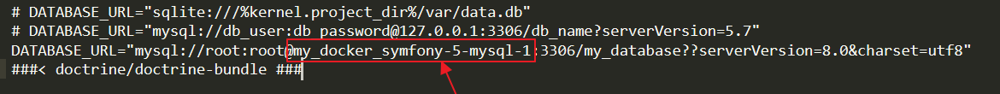

# Docker Symfony 5.4 Test Task 

This development stack includes Symfony 5/Webpack Encore, MySQL, Apache and PHP built with Docker containers using docker-compose tool.

## Services

- MySQL 8.0
- Apache
- PHP7-FPM 7.4
- NodeJS 15.0 ([optional](#other))

## Installation
1. Clone the repository, build services and create/Start containers:
```sh
$ git clone https://github.com/arthur2050/test_tile_expert.git
$ cd test_tile_expert
$ docker-compose build
$ docker-compose up -d
$ docker-compose yarn
$ docker-compose yarn build
$ docker-compose exec php php bin/console doctrine:migrations:migrate
$ docker-compose exec php php bin/console doctrine:fixtures:load

```

2. Visit http://127.0.0.1:8081/main

3. Docker Dashboard main info: 


4. Make migrations:


## Folders structure

```text
docker-symfony-5/
├─ .doc/
├─ .docker/
│ ├─ apache/
│ │   ├─ config/
│ │   └─ Dockerfile
│ ├─ mysql/
│ │   └─ config/
│ └─ php/
│     ├─ config/
│     │    └─ docker-entrypoint.sh
│     └─ Dockerfile
│ ...
│ ├─ .env
│ └─ docker-compose.yml
```

- .doc : documentation for this repository (images etc.), you can skip it completely
- .docker : folder containing Dockerfiles and additional information to run containers. Here is also stored the data of mounted service VOLUME (database files, logs etc.).
- .env : Symfony 5/Docker configuration file - feel free to change regarding your needs
- .docker-compose.yml : definition of multi-container Docker application


## Troubleshooting
> Environment: WINDOWS 10
> Error: Windows Docker Error - standard_init_linux.go:211: exec user process caused "no such file or directory"
> Solution: Error link to CLRF EOL created after repo is pulled. In case of issue, please change the EOL from CRLF to LF in following files.
> (you can use Notepad++ and its option find/replace - \r\n to \n)
```sh
$ cd docker-symfony-5/.docker/php/config/
$ docker-symfony-5/.docker/php/config/Dockerfile
$ docker-symfony-5/.docker/php/config/docker-entrypoint.sh
```

If connection refuse in Database please change name container in .env file


## Commands

```sh
# Docker
$ docker-compose up -d
$ docker-compose down
$ docker-compose up -d --no-deps --build mysql
$ docker-compose up -d --no-deps --build apache
$ docker-compose up -d --no-deps --build php
$ docker-compose exec php sh

# Symfony
$ docker-compose exec php php bin/console cache:clear

# Composer
$ docker-compose exec php composer install

# Yarn
$ docker-compose exec php yarn
$ docker-compose exec php yarn watch
```

## Other
In this starter, Node and Yarn were installed directly in PHP container. However, NodeJS can be swiftly defined as separate service (for React/Vue frontend application etc.) as follow:

```diff
# docker-compose.yml

version: '3.8'
services:
    ...
+  nodejs:
+    build:
+      context: .
+      dockerfile: ./.docker/nodejs/Dockerfile
+    environment:
+      PHP_HOST: php
+      PHP_PORT: 9000
+    volumes:
+      - .:/var/www/html:rw
+    depends_on:
+      - php
```
```diff
# .docker/php/config/Dockerfile

ARG PHP_VERSION=7.4
FROM php:${PHP_VERSION}-fpm-alpine
RUN apk add --update \
    zip \
    unzip \
    curl \
-    nodejs \
-    yarn
...
```

<cite>Source: [Dockerfile](.doc/nodejs/Dockerfile), [docker-entrypoint.sh](.doc/nodejs/docker-entrypoint.sh)</cite>

## Notice
Stack was configured for developments purposes. Please do not consider deploying it on production as is, without previous review.
